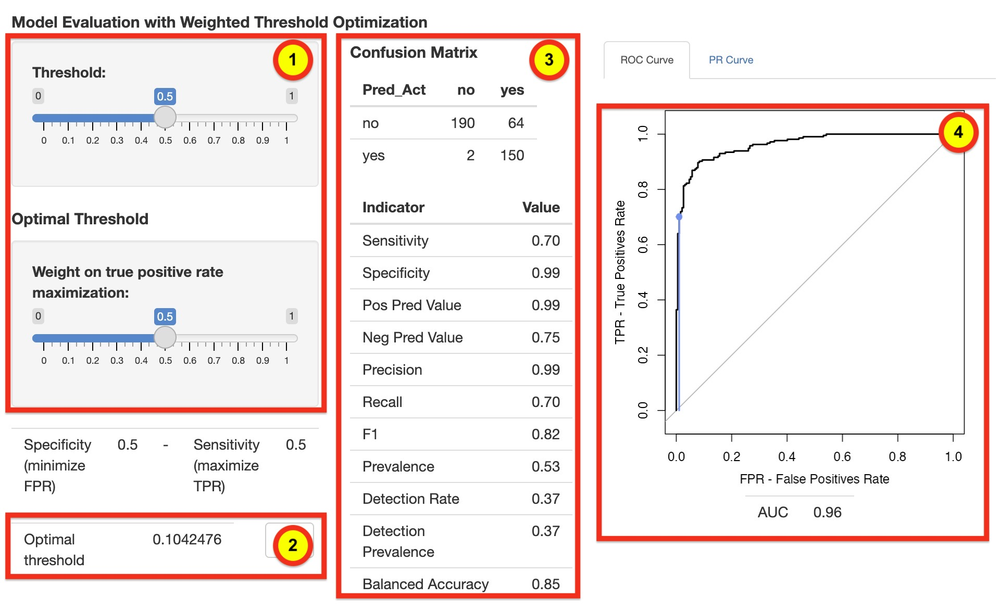

```{r setup, include = FALSE}
knitr::opts_chunk$set(
  collapse = TRUE,
  comment = "#>",
  class.output="scroll-100",
  cache.path = "cached/"
)
# Check if 'priorityelasticnet' is available
if (!requireNamespace("priorityelasticnet", quietly = TRUE)) {
  message("The 'priorityelasticnet' package is not installed. Please install it to fully reproduce this vignette.")
} else {
  library(priorityelasticnet)
}
```

```{css, echo=FALSE}
pre {
  max-height: 300px;
  overflow-y: auto;
}

pre[class] {
  max-height: 300px;
}
```

```{css, echo=FALSE}
.scroll-100 {
  max-height: 100px;
  overflow-y: auto;
  background-color: inherit;
}
```

# Introduction
The integration of high-dimensional omics data has emerged as a critical area of interest in the healthcare sector, presenting substantial potential to improve predictive modeling. Nevertheless, this process faces several challenges, including managing data heterogeneity, establishing a priority order for utilizing predictive information from multiple data blocks, assessing the transfer of information between various omics layers, and tackling multicollinearity issues.

The `priorityelasticnet` package is specifically designed to address these challenges by extending the elastic net method to accommodate grouped predictors in high-dimensional settings.
Building on the foundation of the `prioritylasso` package, `priorityelasticnet` enhances its functionality by integrating the elastic net penalty, which combines $L_1$ (lasso) and $L_2$ (ridge) regularization. This combination is well-known for effectively handling multicollinearity and performing variable selection. By incorporating block-wise penalization, this package allows for more nuanced regularization strategies, where different groups of predictors can be penalized differently, depending on their importance or prior knowledge.The penalized regression models are computed via the R package `glmnet`. Moreover, the R package `survival` is used when the outcome consists of survival data.


One of the features of the `priorityelasticnet` package is its integration of the adaptive-elastic net, which enhances its flexibility and performance. 
By setting `adaptive = TRUE`, this feature builds on the standard elastic net by incorporating data-driven adaptive weights, enabling differential penalization of predictors based on their importance. This approach improves the model’s ability to identify relevant predictors, especially in high-dimensional datasets where strong signals may coexist with a large number of noise variables. 

Users can leverage penalties for various family types, including binomial,multinomial, Gaussian, and Cox, to effectively handle correlated predictors and sparse solutions. In addition, for binary classification problems, the package offers an interactive Shiny application that allows users to explore model performance in a dynamic and user-friendly environment. Users can adjust classification thresholds in real time and evaluate key performance metrics such as sensitivity, specificity, and the area under the receiver operating characteristic (ROC) curve. 

The `priorityelasticnet` package is an ideal tool for statisticians, bioinformaticians, and data scientists working with complex, high-dimensional datasets where the relationships between predictors are structured and important. Whether working on predictive modeling in genomics, image analysis, or finance, this package provides the advanced tools needed to build accurate, interpretable models in challenging data scenarios.

This vignette serves as a comprehensive guide to the `priorityelasticnet` package. It walks you through its main function, *priorityelasticnet*, as well as several other utility functions that enhance its functionality. You will learn how to fit models with grouped predictors using the elastic net method, handle missing data in various ways, perform cross-validation to select the best model parameters, extract and interpret model coefficients, make predictions on new data, and use the Shiny app for interactive model evaluation. By the end of this vignette, you will have a solid understanding of how to apply `priorityelasticnet` to your own data, leveraging its powerful features to tackle even the most challenging high-dimensional problems.

# Overview

To get started, you need to install the `priorityelasticnet` package. If you have the package source, you can install it as follows:

```{r, eval=FALSE}
install.packages("priorityelasticnet")
```


## Key Features

**Flexible Model Families:**
The `priorityelasticnet` package supports a wide range of regression models, making it highly versatile for various types of data and analytical goals. Specifically, it accommodates Gaussian, binomial, Cox, and multinomial regression models. This flexibility allows users to apply the package in different contexts:

**Gaussian Regression:** Ideal for continuous outcomes, the Gaussian model can be used for traditional linear regression, where the goal is to predict a continuous variable based on a set of predictors.  With the integration of *Priority-elastic net* regularization, this approach extends beyond standard elastic net by incorporating block-wise penalization and adaptive weights.  

**Binomial Regression:** Used for binary classification problems, such as predicting whether a patient has a disease (yes/no) or whether a customer will make a purchase (yes/no). The binomial family allows the *priorityelasticnet* function to handle these types of outcomes effectively, applying regularization to manage high-dimensional data and improve the model's predictive accuracy.

**Cox Regression:** The Cox proportional hazards model is widely used in survival analysis, where the focus is on time-to-event data. This model family is crucial for analyzing the impact of various predictors on the time until an event of interest occurs, such as time to death or time to relapse in medical studies. By incorporating elastic net regularization, *priorityelasticnet* function enhances the model's ability to deal with a large number of predictors while maintaining interpretability.

**Multinomial Regression:** When dealing with outcomes that have more than two categories, such as predicting the type of cancer (e.g., lung, breast, prostate) or when the focus is on refining the diagnosis by identifying specific subtypes within a single cancer type, the multinomial regression model is essential. This model family allows for the simultaneous prediction of multiple classes, making `priorityelasticnet` suitable for multi-class classification problems in high-dimensional settings.


**Block-wise Penalization:**
One of the standout features of `priorityelasticnet` is its ability to apply penalties differently across groups or blocks of predictorss, a functionality also present in the `prioritylasso` package. This block-wise penalization enables users to tailor their modeling strategies to the specific structure of their data. 

**Customized Regularization:** In scenarios where certain groups of predictors are believed to be more relevant or should be preserved in the model, users can apply a lighter penalty or even no penalty at all to these blocks. Conversely, less important blocks can be heavily penalized to shrink their coefficients towards zero, effectively performing variable selection within those groups.


**Advanced Missing Data Handling:**
Real-world datasets are often plagued by missing values, which can significantly complicate the modeling process. The `priorityelasticnet` package offers a range of options to handle missing data, ensuring that the model remains robust and accurate:

**Ignoring Missing Data:** For users who prefer a straightforward approach, the package allows for the exclusion of observations with missing data from the analysis. This method is simple but can lead to a loss of valuable information, especially in cases where missing data is extensive.

**Imputing Missing Data:** For a more sophisticated approach, `priorityelasticnet` can impute missing values using offset models. This involves predicting the missing values based on the observed data and incorporating these predictions into the model. This method helps retain as much data as possible while still addressing the issue of missingness.

**Adjusting for Missing Data:** The package also provides the flexibility to adjust the model based on the presence of missing data. For instance, certain blocks of predictors may have systematic missingness, and the model can be adjusted to account for this, reducing potential bias and improving the model's performance.

**Cross-Validation:**
Cross-validation is a critical component of modern statistical modeling, providing a means to evaluate model performance and select the best model parameters. `priorityelasticnet` implements robust cross-validation techniques, allowing users to:

**Model Performance Evaluation:** By dividing the data into multiple folds and training the model on different subsets, cross-validation helps assess how well the model generalizes to new, unseen data. This process helps prevent overfitting and ensures that the model performs well not just on the training data but also on future datasets.

**Parameter Selection:** Cross-validation is also used to select the optimal values for key model parameters, such as the regularization strength (lambda) and the mixing parameter between $L_1$ and $L_2$ penalties (alpha). By systematically testing different parameter values, `priorityelasticnet` identifies the configuration that minimizes prediction error, leading to a more accurate and reliable model.

**Cross-Validated Offset:**
logical, whether CV should be used to estimate the offsets. Default is FALSE.

**Adaptive Regularization:**
The adaptive argument in `priorityelasticnet` introduces an advanced layer of flexibility by enabling the adaptive elastic net, which enhances the standard elastic net through the use of data-driven adaptive weights. These weights allow the penalization strength to vary across predictors based on their importance, with more influential predictors receiving lighter penalties and less significant predictors penalized more heavily.

Additionally, the *initial_global_weight* option provides further customization by allowing users to apply a global weight across all predictors before fitting the adaptive elastic net. 

**Interactive Threshold Optimization:**
For binary classification models, `priorityelasticnet` includes a unique feature that sets it apart: a Shiny application for interactive threshold optimization. This tool provides an intuitive interface for users to:

**Adjust Thresholds:** Users can interactively adjust the classification threshold, which determines the cut-off point at which observations are classified into different categories. This is particularly useful in scenarios where the cost of false positives and false negatives needs to be carefully balanced.

**Model Evaluation:** The Shiny app allows users to see how changes in the threshold affect key performance metrics such as sensitivity (true positive rate) and specificity (true negative rate). This real-time feedback helps users find the optimal threshold that maximizes the model's predictive accuracy while minimizing errors.

**Visualize Performance:** The app also provides visual tools, such as ROC curves and confusion matrices, to help users better understand the trade-offs associated with different thresholds. By visualizing these metrics, users can make informed decisions about the most appropriate threshold for their specific application.

# Priority-Elastic Net

## Example 1: Gaussian Family with Simulated Data

Let's begin by exploring the core functionality of the `priorityelasticnet` package through a straightforward example involving simulated Gaussian data. This example is particularly useful for those new to the package, as it illustrates how to set up and fit an priority-elastic net model with predictors that are logically grouped into blocks. The Gaussian family is the default model used for continuous outcomes, making it an ideal starting point for understanding the basic mechanics of the package.

In many real-world scenarios, predictors can be naturally grouped based on some underlying relationship or structure. For example, in a study involving different types of measurements (like blood pressure, cholesterol levels, and BMI), these measurements might be grouped into blocks representing different biological systems or health indicators. Grouping predictors allows for more tailored regularization strategies, which can improve the interpretability and performance of the model.

**Step 1: Data Simulation**

First, we need to simulate a dataset that will serve as the basis for our model. We'll generate a matrix $\mathbf{X}$ of predictors and a response vector $\mathbf{Y}$. In this example, $\mathbf{X}$ will be a matrix with 100 rows (observations) and 50 columns (predictors). The response vector $\mathbf{Y}$ will be generated from a linear model with some added noise, making it a continuous variable suitable for Gaussian regression.

```{r}
# Simulate some data
set.seed(123)
n <- 100  # Number of observations
p <- 50   # Number of predictors
```

```{r}
# Create a matrix of predictors
X <- matrix(rnorm(n * p), n, p)
```

```{r}
# Generate a response vector based on a linear combination of some predictors
beta <- rnorm(10)  # Coefficients for the first 10 predictors
Y <- X[, 1:10] %*% beta + rnorm(n)  # Linear model with added noise
```

In the above code:

set.seed(123) ensures reproducibility by setting the random number generator's seed.
$\mathbf{X}$ is a matrix of normally distributed random variables, representing the predictors.
$\mathbf{Y}$ is created as a linear combination of the first 10 predictors in $\mathbf{X}$, with some added Gaussian noise to simulate realistic data.

**Step 2: Defining Predictor Blocks**

Next, we'll define how the predictors in $\mathbf{X}$ are grouped into blocks. These blocks can represent different logical groupings of the predictors, which may correspond to different sources of data or different types of variables.

```{r}
# Define predictor blocks
blocks <- list(
  block1 = 1:10,    # First block includes the first 10 predictors
  block2 = 11:30,   # Second block includes the next 20 predictors
  block3 = 31:50    # Third block includes the last 20 predictors
)
```

Here, the blocks list divides the 50 predictors into three distinct groups:

block1 contains the first 10 predictors, which directly influence the response $\mathbf{Y}$.
block2 and block3 contain the remaining predictors, which might be noise or represent other variables in a real-world scenario.

**Step 3: Fitting the Priority-Elastic Net Model**

With the data and blocks defined, we can now fit an priority-elastic net model using the *priorityelasticnet* function. The function will apply regularization to the predictors within each block, allowing for block-specific penalization.

```{r}
# Fit a priorityelasticnet model
fit <- priorityelasticnet(
  X = X, 
  Y = Y, 
  family = "gaussian", 
  blocks = blocks, 
  type.measure = "mse",
  alpha = 0.5
)
```

In the above code:

$\mathbf{X}$ and $\mathbf{Y}$ are the data we simulated earlier.
family = "gaussian" specifies that we are using a Gaussian (linear regression) model, appropriate for continuous outcomes.
blocks defines the grouping of predictors.
$\alpha=0.5$ sets the elastic net mixing parameter, combining both lasso ($L_1$) and ridge ($L_2$) penalties.
The elastic net regularization is controlled by the $\alpha$ parameter, which determines the balance between lasso and ridge penalties:

When $\alpha=1$, the model is purely Priority-lasso, focusing on variable selection by shrinking some coefficients exactly to zero.
When $\alpha=0$, the model is purely ridge, shrinking coefficients towards zero but not exactly to zero, making it better for multicollinear predictors.
$\alpha=0.5$ provides a balance between these two extremes, often yielding a model that performs well in practice by combining the benefits of both regularization techniques.

**Step 4: Interpreting the Results**

After fitting the model, it’s essential to examine the results to understand which predictors were selected and how they contribute to the response variable.

**Lambda Selection**

The selected lambda indices for the models, for each bock, are 64, 8, and 1.

```{r}
fit$lambda.ind
```
Lambda type used is "lambda.min".

```{r}
fit$lambda.type
```

The lambda values corresponding to lambda.min are approximately 0.0093, 0.1980, and 0.2415.

```{r}
fit$lambda.min
```

**Cross-Validation Results**

The minimum cross-validated mean squared errors (min.cvm) for the models are approximately 0.914, 0.720, and 0.710.

```{r}
fit$min.cvm
```

**Number of Non-Zero Coefficients:**

The number of non-zero coefficients in the models are 10, 2, and 0.

```{r}
fit$nzero
```

**GLMNET Model Fits:**

The `glmnet` models show a sequence of deviance reductions and corresponding lambda values for each block, detailing how the model complexity increases with more non-zero coefficients as lambda decreases.

```{r}
fit$glmnet.fit
```

**Coefficients:**

The coefficients for the variables in the model are listed, with many variables having zero coefficients, indicating that they were not selected by the model.

```{r}
fit$coefficients
```

**Predictions and Actual Values:**

The pred matrix contains predicted values, and the observed matrix contains the actual observed values.

```{r}
head(cbind.data.frame(pred = fit$pred[,1], observed = fit$actuals))
```

This example provides a clear introduction to the `priorityelasticnet` package's capabilities in handling high-dimensional data with grouped predictors. By simulating a simple Gaussian dataset, defining predictor blocks, and fitting an elastic net model, you have seen how to apply regularization techniques effectively. This approach is particularly valuable in real-world scenarios where predictors are naturally grouped, allowing for more meaningful and interpretable models.


## Example 2: Cox Family with Simulated Data

The `priorityelasticnet` package supports Cox proportional hazards models, which are commonly used in survival analysis to assess the association between the survival time of subjects and one or more predictor variables. This example demonstrates how to use the package to fit a Cox model with block-wise elastic net regularization, using simulated survival data to illustrate its application.

**Simulating Survival Data**

To demonstrate the functionality, we begin by generating simulated survival data. In this example, we create a dataset with 50 observations (n = 50) and 300 predictors (p = 300). A portion of these predictors have nonzero coefficients, contributing to the simulated survival outcome.

```{r}
# Set seed for reproducibility
set.seed(123)

# Number of observations and predictors
n <- 50  # Number of observations
p <- 300  # Number of predictors

# Number of non-zero coefficients
nzc <- trunc(p / 10)

# Simulate predictor matrix
x <- matrix(rnorm(n * p), n, p)

# Simulate regression coefficients for non-zero predictors
beta <- rnorm(nzc)

# Calculate linear predictor
fx <- x[, seq(nzc)] %*% beta / 3

# Calculate hazard function
hx <- exp(fx)

# Simulate survival times using exponential distribution
ty <- rexp(n, hx)

# Generate censoring indicator (30% censoring probability)
tcens <- rbinom(n = n, prob = .3, size = 1)

# Load survival library and create survival object
library(survival)
y <- Surv(ty, 1 - tcens)
```

*Explanation of the Code:*

* *n* and p define the number of observations and predictors, respectively.

* *x* is a matrix of predictors drawn from a standard normal distribution.

* *beta* represents a set of non-zero coefficients used to simulate a linear predictor, contributing to the hazard function *hx*.

* *ty* is the vector of survival times, generated using an exponential distribution with rate parameter *hx*.

* *y* is a survival object created using the *Surv()* function from the survival package, representing the survival time and censoring status.

**Defining Predictor Blocks**

To apply block-wise regularization, we group the predictors into three blocks. This allows the model to apply different levels of penalization to different sets of predictors, reflecting their varying levels of importance.

```{r}
blocks <- list(
  bp1 = 1:20,    # First block with predictors 1 to 20
  bp2 = 21:200,  # Second block with predictors 21 to 200
  bp3 = 201:300  # Third block with predictors 201 to 300
)
```

*Explanation of the Blocks:*

* *bp1* may represent a core group of predictors with potentially greater influence on survival.

* *bp2* and *bp3* may capture additional predictors, offering flexibility for different levels of regularization.

**Fitting a Cox Model with Priority-Elastic Net**

We proceed to fit the Cox model using the *priorityelasticnet* function, applying block-wise elastic net regularization to manage the high-dimensional data.

```{r}
# Fit Cox model using priorityelasticnet
fit_cox <- priorityelasticnet(
  x, 
  y, 
  family = "cox", 
  alpha = 0.5, 
  type.measure = "deviance", 
  blocks = blocks,
  block1.penalization = TRUE,
  lambda.type = "lambda.min",
  standardize = TRUE,
  nfolds = 10,
  cvoffset = TRUE
  
)
```

*Key Parameters Explained:*

* *family = "cox"* specifies that we are fitting a Cox proportional hazards model for survival data.

* *type.measure = "deviance"* sets the measure used for cross-validation, with deviance measuring model fit.

* *blocks* defines the predictor groups for block-wise regularization.

* *block1.penalization = TRUE* allows penalization within the first block, enabling the model to shrink coefficients within this block based on their relevance.

* *lambda.type = "lambda.min"* uses the lambda value minimizing cross-validated deviance for model selection.

* *standardize = TRUE* scales predictors to have zero mean and unit variance, which is crucial when predictors vary in scale.

* *nfolds = 10* specifies 10-fold cross-validation for model validation.


**Evaluating the Model**

After fitting, it’s important to evaluate the model's performance and review the selected coefficients and lambda values.

*Cross-Validated Deviance*

```{r}
fit_cox$min.cvm
```

This provides the minimum cross-validated deviance, indicating how well the model predicts the survival times.

*Coefficients*

```{r}
fit_cox$coefficients
```

This outputs the estimated coefficients for each predictor within each block, helping to understand their contribution to the survival outcome.

*Lambda Selection*

```{r}
fit_cox$lambda.min
```

The selected lambda value, balancing model complexity and predictive performance.

This example demonstrates the flexibility of the `priorityelasticnet` package in handling survival data with Cox proportional hazards models. By using block-wise elastic net regularization, we can apply differential penalization to different groups of predictors, making it a powerful approach for modeling complex, high-dimensional survival data.

*Kaplan-Meier Curve*

The Kaplan-Meier curve in this example is used to visualize and compare survival probabilities between two risk groups (High Risk and Low Risk) identified using the *priorityelasticnet* Cox proportional hazards model and using  function *separate2GroupsCox* from `glmSparseNet` package.


```{r, eval = requireNamespace("glmSparseNet", quietly = TRUE)}

library(glmSparseNet)

# Extract coefficients from the fitted Cox model
chosen.btas <- fit_cox$coefficients
y <- data.frame(
  time = ty,          # Survival times
  status = 1 - tcens  # Event indicator
)

# Group patients and plot Kaplan-Meier survival curves
separate2GroupsCox(
  chosen.btas = chosen.btas,  # Coefficients from the model
  xdata = x,                  # Predictor matrix (xdata)
  ydata = y,                  # Survival data (ydata as Surv object)
  probs = c(0.4, 0.6),        # Median split (adjust if necessary)
  no.plot = FALSE,            # Plot the Kaplan-Meier curve
  plot.title = "Survival Curves",  # Plot title
  xlim = NULL,                # Automatic x-axis limits
  ylim = NULL,                # Automatic y-axis limits
  expand.yzero = FALSE,       # Don't force y-axis to start at zero
  legend.outside = FALSE      # Keep legend inside the plot
)

```

*  The *p-value =  5.707024e-06* strongly indicates a statistically significant difference in survival between the two groups.

*  This plot demonstrates that the risk stratification (High Risk vs. Low Risk) is meaningful and robust.

* In our model, individuals are classified into the low-risk group if their calculated relative risk is less than or equal to the median.

* Conversely, the high-risk group includes individuals whose relative risk exceeds the median.

## Example 3: Binomial Family with Simulated Glioma Data

In this example, we will explore how to apply the `priorityelasticnet` package for binary classification. Binary classification is a common task in many fields, such as medical diagnosis, fraud detection, and marketing, where the goal is to classify observations into one of two categories based on a set of predictors.

We will use the *Pen_Data* dataset, which comes with the `priorityelasticnet` package. Please note that *Pen_Data* is not real data, but rather simulated within the `priorityelasticnet` package. This dataset includes a binary response variable along with a large number of predictors, making it an excellent candidate for applying elastic net regularization. The predictors are grouped into blocks, which might represent different categories of features, such as demographic information, behavioral data, or genetic markers.

**Load the Data**

First, we will load the Pen_Data dataset, which is included in the `priorityelasticnet` package. This dataset has 325 columns, where the first 324 columns are predictors and the last column is the binary response variable.


```{r}

# Check if 'priorityelasticnet' is available
if (!requireNamespace("priorityelasticnet", quietly = TRUE)) {
  message("The 'priorityelasticnet' package is not installed. Please install it to fully reproduce this vignette.")
} else {
  library(priorityelasticnet)
  # Load the dataset only if the package is available
  data("Pen_Data", package = "priorityelasticnet")
  
}


```
```{r}
dim(Pen_Data)


```
The *Pen_Data* dataset is structured as follows:

* The first 324 columns (Pen_Data[, 1:324]) represent the predictors.
* The 325th column (Pen_Data[, 325]) is the binary outcome variable, with values typically coded as 0 and 1, representing the two classes.

**Define Predictor Blocks**

Similar to the previous examples, we need to define how the predictors are grouped into blocks. The predictors in this dataset are divided into four blocks. These blocks could represent different types of data or features that are logically grouped together. In a real-world scenario, these blocks might correspond to different sources of data, such as clinical measurements, genetic data, or questionnaire responses.

```{r}
blocks <- list(
  block1 = 1:5,     # Block 1: First 5 predictors
  block2 = 6:179,   # Block 2: Next 174 predictors
  block3 = 180:324  # Block 3: Next 145 predictors
  
)
```

**Fit the Elastic Net Model**

```{r}
set.seed(123)

fit_bin <- priorityelasticnet(
  X = as.matrix(Pen_Data[, 1:324]), 
  Y = Pen_Data[, 325],
  family = "binomial", 
  alpha = 0.5, 
  type.measure = "auc",
  blocks = blocks,
  standardize = FALSE
)
```

Here’s what each parameter does:

* X is the matrix of predictors from the *Pen_Data* dataset.
* Y is the binary response variable.
* family = "binomial" indicates that we are fitting a logistic regression model suitable for binary classification.
* alpha = 0.5 specifies a mix of lasso and ridge penalties, which helps in both variable selection and multicollinearity management.
* type.measure = "auc" selects the AUC as the metric for cross-validation, which is a robust measure of the model's ability to discriminate between the two classes.
* blocks defines the structure of the predictors into meaningful groups, which will be penalized differently during model fitting.
* standardize = FALSE indicates that the predictors should not be standardized, which might be appropriate if the data is already on a comparable scale or if the original scale is meaningful.

**Making Predictions**

With the model fitted, you can now use it to make predictions on new data. This is particularly useful when you want to classify new observations or assess the model's performance on a test set.

```{r}
predictions <- predict(fit_bin, type = "response")
head(predictions)

```

In this step:

* type = "response" returns the predicted probabilities of each observation belonging to the positive class (e.g., the probability of having a disease).
* The predict function can be applied to new datasets, enabling you to extend the model's application beyond the original training data.

You can also make predictions for new data using the fitted binomal model.

```{r}
predictions <- predict(fit_bin, newdata = as.matrix(Pen_Data[, 1:324]), type = "response")
head(predictions)
```

In this example, type = "response" gives the predicted class probabilities for each observation in the new dataset X_new.


**Further Analysis and Visualization**

To gain deeper insights into the model, you might want to explore additional aspects, such as the importance of different blocks, the distribution of predicted probabilities, or the performance across different subsets of the data.

For example, you can visualize the ROC curve to assess the model's discrimination ability:

```{r}
library(pROC)
roc_curve <- roc(Pen_Data[, 325], predictions[,1])
plot(roc_curve, col = "red", main = "ROC Curve for Binomial Model")
text(0.1, 0.1, labels = paste("AUC =", round(roc_curve$auc, 2)), col = "black", cex = 1.2)


```

This ROC curve will help you visually inspect the trade-off between sensitivity and specificity across different thresholds, providing a comprehensive view of the model's classification performance.

This example demonstrates the power and flexibility of the `priorityelasticnet` package when applied to binary classification tasks using real data. By fitting an elastic net model with block-wise penalization, you can efficiently handle high-dimensional datasets with structured predictors. The ability to customize the penalization strategy, combined with robust cross-validation and performance metrics like AUC, ensures that you can build accurate and interpretable models even in challenging scenarios.

## Example 4: Multinomial Family with Simulated Data

The `priorityelasticnet` package also supports the multinomial family, which is particularly useful for addressing multi-class classification problems where the response variable can take on more than two categories. This makes it an ideal tool for applications such as predicting categorical outcomes in fields like image classification, text categorization, or medical diagnostics involving multiple disease types. Below is a detailed example using simulated data to demonstrate how to fit a multinomial model using the `priorityelasticnet` package.

**Simulate Some Data**

To illustrate the use of the multinomial family, we first need to generate some simulated data. In this example, we create a dataset with 100 observations (n = 100), each having 50 predictors (p = 50). The response variable $\mathbf{Y}$ will have three possible classes (k = 3), which could represent different categories or labels in a classification task.

```{r}
# Set seed for reproducibility
set.seed(123)

# Number of observations and predictors
n <- 100  # Number of observations
p <- 50   # Number of predictors
k <- 3    # Number of classes

# Simulate a matrix of predictors
x <- matrix(rnorm(n * p), n, p)

# Simulate a response vector with three classes
y <- factor(sample(1:k, n, replace = TRUE))
```
In this code:

* x is a matrix of predictors, where each element is drawn from a standard normal distribution.
* y is the response vector, a factor with three levels representing different classes. These could correspond to distinct categories such as "low", "medium", and "high" in a risk assessment model, or different types of diagnoses in a medical study.

**Define Predictor Blocks**

Next, we define how the predictors in X are grouped into blocks. This step is crucial as it allows the model to apply different levels of penalization to different groups of predictors, which might have varying levels of importance or relevance to the outcome.

```{r}
blocks <- list(
  block1 = 1:10,   # First block with predictors 1 to 10
  block2 = 11:30,  # Second block with predictors 11 to 30
  block3 = 31:50   # Third block with predictors 31 to 50
)
```
In this example:

* block1 might represent a core set of features that are expected to have a significant impact on the classification outcome.
* block2 and block3 might include additional predictors, potentially capturing different dimensions or types of information related to the classes.

By grouping predictors into blocks, we can control the regularization strength applied to each group, allowing for more nuanced modeling strategies. This is particularly useful in high-dimensional settings where certain groups of predictors are expected to be more informative than others.

**Fit a Model for Multinomial Classification**

With the data and predictor blocks ready, we can now fit a multinomial model using the *priorityelasticnet* function. This function applies elastic net regularization within each block, combining the strengths of both lasso ($L_1$) and ridge ($L_2$) penalties to handle high-dimensional data effectively.

```{r}
fit_multinom <- priorityelasticnet(
  X = x, 
  Y = y, 
  family = "multinomial", 
  alpha = 0.5, 
  type.measure = "class", 
  blocks = blocks,
  block1.penalization = TRUE,
  lambda.type = "lambda.min",
  standardize = TRUE,
  nfolds = 5
)
```

Here’s a breakdown of the key parameters:

* family = "multinomial" specifies that we are fitting a model suitable for multi-class classification, where the response variable Y has more than two levels.
* alpha = 0.5 sets the elastic net mixing parameter, providing a balance between lasso ($L_1$) and ridge ($L_2$) regularization.
* type.measure = "class" indicates that the model's performance during cross-validation should be evaluated based on classification accuracy, which is the proportion of correctly classified observations.
* blocks defines the groups of predictors, allowing for differential penalization across these blocks.
* block1.penalization = TRUE means that the first block will be penalized, allowing the model to shrink coefficients within this block based on its relevance to the classification task.
* lambda.type = "lambda.min" specifies that the lambda value that minimizes cross-validated error should be used, which often results in a model with the best generalization performance.
* standardize = TRUE indicates that the predictors should be standardized (mean-centered and scaled to unit variance) before fitting the model. This is particularly important when the predictors have different units or scales.
* nfolds = 5 sets the number of folds for cross-validation, where the data is split into 5 parts to evaluate the model’s performance and select the optimal lambda.


**Evaluate the Model**

After fitting the model, it's essential to evaluate its performance. The *priorityelasticnet* function will have already performed cross-validation to select the best lambda value and estimate the classification accuracy.

The summary of the fitted multinomial model will provide valuable insights, including:

* **Cross-Validation Results:** The mean cross-validated errors for each lambda value tested during cross-validation, helping to understand how different levels of regularization impact the model’s ability to correctly classify observations.

```{r}
fit_multinom$min.cvm
```

* **Coefficients:** The estimated coefficients for each predictor within each block, across the different classes. These coefficients show how each predictor contributes to the probability of each class.

```{r}
fit_multinom$coefficients
```

* **Lambda Selection:** The lambda value that was selected based on cross-validation, which balances model complexity and performance.

```{r}
fit_multinom$lambda.min
```
This example demonstrates the versatility of the `priorityelasticnet` package in handling multi-class classification problems using the multinomial family. By simulating a dataset with multiple classes and fitting a multinomial elastic net model, you can see how block-wise regularization can be applied to complex, high-dimensional data. The model's ability to handle multiple classes with different levels of penalization across predictor blocks makes it a powerful tool for a wide range of classification tasks.

# Advanced Features
## Block-wise Penalization

The *priorityelasticnet* function provides a flexible approach to block-wise penalization, enabling different regularization strategies for distinct groups of predictors. This functionality is particularly valuable when you have prior knowledge about certain predictor groups that might require unique treatment. For instance, you may have a block of predictors that are known to be highly informative or essential for the model's predictive power and, therefore, should not be penalized. Conversely, other blocks can be regularized to manage multicollinearity, reduce model complexity, or enhance generalization.

In the example below, we demonstrate how to exclude the first block of predictors from penalization. The data used in this example, **X** and **Y**, are generated under a Gaussian model.

```{r}
fit_no_penalty <-
  priorityelasticnet(
    X,
    Y,
    family = "gaussian",
    type.measure = "mse",
    blocks = blocks,
    block1.penalization = FALSE
  )
```

Here, the block1.penalization = FALSE argument ensures that the first block of predictors is left unpenalized, while the remaining blocks undergo regularization. This approach is particularly useful in situations where the first block contains variables that are critical to the model, such as demographic information, baseline measurements, or other covariates that you want to retain in their original form without shrinkage.

After fitting the model, you can inspect the results to understand how the penalization has been applied across the different blocks:

```{r}
fit_no_penalty
```

The output provides detailed information about the selected lambda values, the number of non-zero coefficients in each block, and the deviance explained by the model. By analyzing these results, you can assess the impact of block-wise penalization on model performance and make informed decisions about which blocks should be penalized or left unpenalized in your specific application.

This capability allows for a more nuanced model construction, where penalization is tailored to the characteristics and importance of different predictor groups, ultimately leading to a more robust and interpretable model.

## Handling Missing Data

Handling missing data is a crucial aspect of building robust models, especially when working with real-world datasets where missing values are common. The priorityelasticnet function provides several options for managing missing data, allowing you to choose the most appropriate strategy based on the nature of your dataset and the goals of your analysis.

The mcontrol argument in priorityelasticnet enables you to specify how missing data should be handled. This flexibility ensures that your model can be fitted even when dealing with incomplete data, which might otherwise lead to biased estimates or reduced predictive power.

Below, we demonstrate how to configure the mcontrol argument to handle missing data by imputing offsets. To exemplify the process of handling missing values, this example uses data generated under a Gaussian model.

```{r}
mcontrol <-missing.control(handle.missingdata = "impute.offset", nfolds.imputation = 5)

fit_missing <- priorityelasticnet(
  X,
  Y,
  family = "gaussian",
  type.measure = "mse",
  blocks = blocks,
  mcontrol = mcontrol
)
```

In this example, the handle.missingdata = "impute.offset" option tells the priorityelasticnet function to impute missing values using an offset approach. This method is particularly useful when missing data is sporadic and you want to ensure that the model can incorporate all available information without discarding incomplete observations.

After fitting the model with the specified missing data handling strategy, you can examine the results:

```{r}
fit_missing
```

The output will include information on how the missing data was handled, the imputation models used (if applicable), and the overall model fit. By inspecting these details, you can assess whether the chosen missing data strategy effectively maintained the integrity of your analysis.

**Custom Strategies for Handling Missing Data**

The *priorityelasticnet* function also allows for more customized strategies via the mcontrol argument. For example, you can set specific parameters for imputation, such as the number of folds used for cross-validation during imputation (nfolds.imputation) or thresholds for the percentage of complete cases required (perc.comp.cases.warning). These options enable a tailored approach to missing data, ensuring that your model is both robust and accurate.

Moreover, *priorityelasticnet* supports different imputation methods, including mean imputation, median imputation, and more complex model-based imputations. This versatility allows you to adapt the model to the specific characteristics of your dataset, whether you're dealing with large gaps in the data, patterns of missingness, or particular concerns about bias.

In summary, the *priorityelasticnet* function's handling of missing data is highly flexible, allowing you to choose and customize strategies that best suit your analysis. Whether you opt for simple offset imputation or more complex approaches, the key is to maintain the integrity of your data while ensuring that your model remains robust and interpretable, even in the presence of missing values.

## Cross-Validation and Model Selection

The *cvm_priorityelasticnet* function is a powerful tool for comparing different block configurations and selecting the optimal model based on cross-validation error. This functionality is particularly valuable when dealing with complex datasets where the structure of the predictor variables can significantly impact model performance.

In the following example, we demonstrate how to use the *cvm_priorityelasticnet* function to evaluate and compare different block configurations. The data for this demonstration is derived from a Gaussian model.

```{r}
blocks1 <- list(1:10, 11:30, 31:50)
blocks2 <- list(1:5, 6:20, 21:50)

fit_cvm <-
  cvm_priorityelasticnet(
    X,
    Y,
    blocks.list = list(blocks1, blocks2),
    family = "gaussian",
    type.measure = "mse",
    weights = NULL,
    foldid = NULL
  )
```

In this example, we define two different block configurations, blocks1 and blocks2, and pass them to the cvm_priorityelasticnet function. The function then performs cross-validation on each configuration, calculating the mean squared error (MSE) for each model. By comparing these MSE values, you can identify which block configuration yields the best predictive performance.

```{r}
fit_cvm
```

The output from fit_cvm provides detailed information on the performance of each block configuration. This includes cross-validated MSE values, the optimal lambda for each configuration, and the number of non-zero coefficients selected by the model. By examining these results, you can make an informed decision about which block configuration to choose for your final model.

**Selecting the Optimal Model**

After comparing the different block configurations, the next step is to select the optimal model. The cvm_priorityelasticnet function simplifies this process by clearly indicating the configuration with the lowest cross-validation error. This configuration is considered the best in terms of predictive accuracy and generalizability to new data.

In some cases, you may want to further explore the selected model by inspecting the coefficients, prediction accuracy, or other performance metrics. The priorityelasticnet function allows you to refit the model using the optimal block configuration and lambda values identified during cross-validation. This approach ensures that your final model is both well-calibrated and fine-tuned for the specific structure of your data.

**Practical Considerations**

When using cross-validation for model selection, it's important to consider the computational cost, especially when working with large datasets or numerous block configurations. The cvm_priorityelasticnet function is designed to handle these scenarios efficiently, but it may be beneficial to parallelize the computation or reduce the number of folds in cases where computational resources are limited.

Moreover, while cross-validation is a robust method for model selection, it's essential to validate the final model on an independent test set to ensure that the chosen configuration generalizes well to unseen data. This additional step can help guard against overfitting and provide greater confidence in the model's predictive capabilities.

In conclusion, the cvm_priorityelasticnet function offers a systematic approach to model selection by leveraging cross-validation to compare different block configurations. By selecting the model with the lowest cross-validation error, you can optimize predictive performance while maintaining flexibility in how different groups of predictors are treated within the model.

## Using the Shiny App for Threshold Optimization

For binary classification problems, the priorityelasticnet package includes a Shiny application called weightedThreshold, which is designed for interactive threshold optimization. This tool is particularly useful when you need to fine-tune the decision threshold for your model to balance performance metrics like sensitivity and specificity according to the specific requirements of your task.

**Launching the Shiny App**

The weightedThreshold function launches a Shiny app that provides a user-friendly interface for exploring how different threshold values impact the model's classification performance. You can launch the app with a simple command:

```{r, eval = FALSE}
weightedThreshold(object = fit_bin)
```

Here, fit_bin is the binary classification model fitted using the *priorityelasticnet* function. When you run this command, the Shiny app opens in your default web browser, displaying various performance metrics and allowing you to adjust the threshold interactively.



**Features of the Shiny App**

The Shiny app offers several features to help you optimize the decision threshold for your binary classification model:

**1. Interactive Threshold Adjustment:** The app allows you to slide the threshold bar and immediately see the effects on key performance metrics such as sensitivity, specificity, accuracy, precision, and F1 score. This interactivity helps you understand how different thresholds influence the balance between false positives and false negatives.

**2. Threshold Recommendations:** Based on the performance metrics and the ROC curve, the app can suggest optimal thresholds, such as the one that maximizes the Youden Index (sensitivity + specificity - 1) or the one that provides the best balance between precision and recall.

**3. Real-time Performance Metrics:** As you adjust the threshold, the app updates the performance metrics in real-time. This dynamic feedback enables you to make data-driven decisions on the optimal threshold based on the specific needs of your application. For instance, if minimizing false negatives is crucial (e.g., in medical diagnostics), you can adjust the threshold to prioritize sensitivity.

**4. ROC Curve Visualization:** The app also displays the Receiver Operating Characteristic (ROC) curve, which plots the true positive rate against the false positive rate at various threshold settings. The ROC curve helps you visualize the trade-off between sensitivity and specificity, and the area under the curve (AUC) provides an overall measure of the model's discriminative ability.

# Utility Functions
## Extracting Coefficients

The *coef.priorityelasticnet* function is a crucial tool for interpreting the results of a fitted model. It allows you to extract the estimated coefficients, which represent the relationship between the predictors and the response variable. Understanding these coefficients is essential for gaining insights into how each predictor influences the outcome, particularly in the context of penalized regression models where some coefficients may be shrunk towards zero or set to zero due to regularization.

Here’s how you can extract the coefficients from a fitted binary classification model:

```{r}
coef(fit_bin)
```

In this example, fit_bin is a model fitted using the *priorityelasticnet* function. The extracted coefficients can help you identify which predictors are most influential in predicting the response variable. For example, non-zero coefficients indicate predictors that contribute to the model, while zero coefficients suggest that the corresponding predictors have been effectively excluded due to penalization.

In models fitted with regularization methods such as elastic net, the coefficients are often shrunken to prevent overfitting and to enhance the model's generalizability to new data. The amount of shrinkage depends on the regularization parameters, with stronger regularization leading to more coefficients being reduced towards zero. By examining the extracted coefficients, you can assess the relative importance of each predictor and make decisions about which variables are essential for your model.

For example, in a model with several blocks of predictors, you might find that only a few predictors have non-zero coefficients, indicating that these are the most relevant features for predicting the outcome.

## Making Predictions

The *predict.priorityelasticnet* function is used to generate predictions from a fitted model. This function can produce different types of predictions depending on the specified type parameter, including linear predictors, fitted values, or class probabilities (in the case of classification models).

Here’s how you can generate predictions from a fitted model using new data:

```{r}
set.seed(123)
X_new <- matrix(rnorm(406 * 324), 406, 324)

predictions < predict(fit_bin, newdata = X_new, type = "response")
head(predictions)
```

In this example, fit_bin is the fitted model, and X_new is the new data for which you want to generate predictions. The type = "response" parameter specifies that you want the predictions to be in the form of fitted values (e.g., probabilities for binary classification or actual values for regression).

**Types of Predictions**

* Linear Predictors (type = "link"): These are the raw predictions from the linear model before applying any transformation (e.g., before applying the logistic function in logistic regression). This option is useful when you want to analyze the linear relationship between the predictors and the response.

* Fitted Values (type = "response"): These are the transformed predictions that correspond to the actual scale of the response variable. For binary classification, this would typically be the predicted probabilities of the positive class.


Certainly! Here's a more detailed and structured vignette section that first introduces the concept of the Adaptive-Elastic net in Priority-elastic net algorithm, followed by the sophisticated example.

# Priority-Adaptive Elastic Net

In high-dimensional data analysis regularization techniques like Lasso and elastic net are essential for preventing overfitting and improving model interpretability. These methods work by shrinking some of the predictor coefficients to zero, effectively selecting a subset of features that contribute most to the model.

However, not all predictors are created equal. Some may have a strong relationship with the response variable, while others might have a weaker relationship, and many could be purely noise. In such cases, treating all predictors the same during regularization might not be ideal.

This is where the Adaptive-Elastic net comes into play, as demonstrated in our previous examples. By incorporating the adaptive argument, we showed how the `priorityelasticnet` package applies different penalties to predictors based on their importance, allowing for a more nuanced regularization approach. This method dynamically adjusts the penalty for each predictor, shrinking less important predictors more aggressively while preserving the influence of key predictors.


**1. Fit an Initial Model:** First, fit a standard elastic net model to obtain initial estimates of the coefficients.

* You can choose to calculate these initial estimates either globally, where the weights are computed based on all predictors in the dataset, or block-wise, where the initial model is fit separately for each block of predictors.

**2. Calculate Adaptive Weights:** Compute weights based on these initial coefficients, where predictors with larger coefficients (indicating more importance) receive smaller penalties in the final model.

* If you selected global weighting, the adaptive weights are computed from the initial model fit to all predictors. For block-wise weighting, the adaptive weights are computed separately for each block, ensuring that the weight calculation respects the hierarchical block structure.

**3. Apply Adaptive Penalties:** Refit the model using these adaptive weights, allowing more important predictors to retain larger coefficients while shrinking less important ones more aggressively.

This approach allows the model to be more flexible and accurate in selecting relevant features, particularly when there is a clear distinction between strong, weak, and irrelevant predictors. The option to use global or block-wise initial weights provides additional flexibility, enabling the model to either prioritize across all predictors simultaneously (global) or account for differences within each block (block-wise), depending on the structure of the data.

## Example 1: Gaussian Model

Now, let’s see how the Priority-Adaptive elastic net works in practice. We will walk through examples that demonstrate its application on a simulated dataset containing a mix of strong, weak, and noise predictors.

**Step 1: Simulating the Data**

We begin by simulating a dataset with 200 observations and 100 predictors. Among these:

* **10 predictors** are strongly associated with the response variable.
* **20 predictors** are weakly associated with the response.
* The remaining **70 predictors** are noise, meaning they have no real association with the response.

The response variable is generated by combining the effects of these predictors with some added noise.

```{r}
# Set the random seed for reproducibility
set.seed(1234)

# Simulate high-dimensional data
n <- 200  # Number of observations
p <- 100  # Number of predictors
n_strong <- 10  # Number of strong predictors
n_weak <- 20  # Number of weak predictors

# Design matrix (predictors)
X <- matrix(rnorm(n * p), nrow = n, ncol = p)

# Generate coefficients: strong predictors with large effects, weak with small effects
beta <- c(rep(2, n_strong), rep(0.5, n_weak), rep(0, p - n_strong - n_weak))

# Generate response with Gaussian noise
Y <- X %*% beta + rnorm(n)
```

**Step 2: Defining Predictor Blocks**

We categorize the predictors into three blocks:

* **Strong Block:** Contains the 10 strong predictors.
* **Weak Block:** Contains the 20 weak predictors.
* **Noise Block:** Contains the 70 noise predictors.

These blocks allow the *priorityelasticnet* function to apply penalties differently across these groups, which is crucial for the Priority-Adaptive elastic net.

```{r}
# Define blocks of predictors for the model
blocks <- list(
  strong_block = 1:n_strong,               # Strong predictors
  weak_block = (n_strong + 1):(n_strong + n_weak),  # Weak predictors
  noise_block = (n_strong + n_weak + 1):p  # Noise (irrelevant predictors)
)
```

**Step 3: Running the Priority-Adaptive Elastic Net**

With the data and blocks defined, we apply the Adaptive-Elastic net using the *priorityelasticnet* function. The `adaptive` argument is set to `TRUE`, which tells the function to calculate adaptive penalties based on an initial model fit. Moreover, initial_global_weight argument is set to FALSE in order to calculate initial weights separately for each block.

```{r}
# Run priorityelasticnet with Adaptive Elastic Net
result <- priorityelasticnet(X = X, 
                             Y = Y, 
                             family = "gaussian", 
                             alpha = 0.5, 
                             type.measure = "mse", 
                             blocks = blocks, 
                             adaptive = TRUE,
                             initial_global_weight = FALSE, 
                             verbose = TRUE)
```


**Step 4: Analyzing the Results**

After fitting the model, we can inspect the final coefficients and the adaptive weights that were applied. The adaptive weights indicate how much each predictor was penalized in the final model, based on its initial importance.

```{r}
# Examine the coefficients
cat("Final model coefficients:")
result$coefficients
```

```{r}
# Examine the adaptive weights
cat("Adaptive weights for each predictor:")
result$adaptive_weights
```

**Step 5: Visualizing the Coefficient Paths**

To better understand how the Priority-Adaptive Elastic net handled different groups of predictors, we can visualize the coefficient paths for each block. These plots show how the coefficients change as the regularization parameter (lambda) varies, providing insight into how strongly each group of predictors was penalized.

```{r}
plot(result$glmnet.fit[[1]], xvar = "lambda", label = TRUE, main = "Coefficient Paths for Strong Block")
```

```{r}
plot(result$glmnet.fit[[2]], xvar = "lambda", label = TRUE, main = "Coefficient Paths for Weak Block")
```

```{r}
plot(result$glmnet.fit[[3]], xvar = "lambda", label = TRUE, main = "Coefficient Paths for Noise Block")
```

This example demonstrates how this model can effectively differentiate between strong, weak, and irrelevant predictors in a high-dimensional dataset. By applying adaptive penalties for each block, the model ensures that important predictors are retained while less relevant ones are shrunk toward zero. This approach not only improves feature selection but also enhances the overall predictive performance of the model.

The coefficient paths provide a clear visual representation of how the adaptive penalties work, showing that strong predictors remain in the model even with higher levels of regularization, while noise predictors are eliminated. This example highlights the power and flexibility of the Priority-Adaptive elastic net, making it a valuable tool in high-dimensional data analysis.

## Example 2: Cox Model

**Step 1: Running the Priority-Adaptive Elastic Net**

```{r}
# Set seed for reproducibility
set.seed(123)

# Number of observations and predictors
n <- 50  # Number of observations
p <- 300  # Number of predictors

# Number of non-zero coefficients
nzc <- trunc(p / 10)

# Simulate predictor matrix
x <- matrix(rnorm(n * p), n, p)

# Simulate regression coefficients for non-zero predictors
beta <- rnorm(nzc)

# Calculate linear predictor
fx <- x[, seq(nzc)] %*% beta / 3

# Calculate hazard function
hx <- exp(fx)

# Simulate survival times using exponential distribution
ty <- rexp(n, hx)

# Generate censoring indicator (30% censoring probability)
tcens <- rbinom(n = n, prob = .3, size = 1)

# Load survival library and create survival object
library(survival)
y <- Surv(ty, 1 - tcens)
```


```{r}
blocks <- list(
  bp1 = 1:20,    # First block with predictors 1 to 20
  bp2 = 21:200,  # Second block with predictors 21 to 200
  bp3 = 201:300  # Third block with predictors 201 to 300
)
```


```{r}
# Fit Cox model using priorityelasticnet
result_cox <- priorityelasticnet(
  x, 
  y, 
  family = "cox", 
  alpha = 1, 
  type.measure = "deviance", 
  blocks = blocks,
  block1.penalization = TRUE,
  lambda.type = "lambda.min",
  standardize = TRUE,
  nfolds = 5,
  adaptive = TRUE,
  initial_global_weight = FALSE
)
```

**Step 2: Analyzing the Results**

```{r}
# Examine the coefficients
cat("Final model coefficients:")
result_cox$coefficients

```

```{r}
result_cox$initial_coeff
```


```{r}
# Examine the adaptive weights
cat("Adaptive weights for each predictor:")
result_cox$adaptive_weights
```


## Example 3: Binomial Model

**Step 1: Running the Priority-Adaptive Elastic Net**

```{r}
# Run priorityelasticnet with Adaptive Elastic Net
result_bin <- priorityelasticnet(X = as.matrix(Pen_Data[, 1:324]), Y = Pen_Data[, 325],
                             family = "binomial", alpha = 0.5, type.measure = "auc",
                             blocks = list(bp1 = 1:5, bp2 = 6:179, bp3 = 180:324),
                             standardize = FALSE,
                             adaptive = TRUE,
                             initial_global_weight = FALSE, 
                             verbose = TRUE)
```
**Step 2: Analyzing the Results**

```{r}
result_bin$nzero
```
```{r}
result_bin$min.cvm
```
```{r}
result_bin$lambda.min
```
```{r}
result_bin$adaptive_weights
```


```{r}
result_bin$coefficients
```
```{r}
predictions <- predict(result_bin, newdata = as.matrix(Pen_Data[, 1:324]), type = "response")
head(predictions)
```

```{r}
library(pROC)
roc_curve <- roc(Pen_Data[, 325], predictions[,1])
plot(roc_curve, col = "red", main = "ROC Curve for Binomial Model")
text(0.1, 0.1, labels = paste("AUC =", round(roc_curve$auc, 2)), col = "black", cex = 1.2)


```

The *Priority-Adaptive elastic net* outperforms the *Priority-elastic net* for the binomial family, as shown by the Area Under the ROC Curve (AUC). The *Priority-Adaptive elastic net* achieves an AUC of 0.99, indicating near-perfect discrimination, compared to 0.96 for the *Priority-elastic net*. This improvement stems from its adaptive weighting scheme, which dynamically prioritizes important predictors, unlike the fixed penalties in the Priority-Elastic net. The higher AUC underscores the enhanced predictive accuracy of the Priority-Adaptive elastic net.


## Example 4: Multinomial Model


```{r}
# Set seed for reproducibility
set.seed(123)

# Number of observations and predictors
n <- 100  # Number of observations
p <- 50   # Number of predictors
k <- 3    # Number of classes

# Simulate a matrix of predictors
x <- matrix(rnorm(n * p), n, p)

# Simulate a response vector with three classes
y <- factor(sample(1:k, n, replace = TRUE))
```


**Step 1: Define Predictor Blocks**


```{r}
blocks <- list(
  block1 = 1:10,   # First block with predictors 1 to 10
  block2 = 11:30,  # Second block with predictors 11 to 30
  block3 = 31:50   # Third block with predictors 31 to 50
)
```

**Step 2: Running the Priority-Adaptive Elastic Net **

```{r}

# Run priorityelasticnet
result_multinom <- priorityelasticnet(
  X = x, 
  Y = y, 
  family = "multinomial", 
  alpha = 0.5, 
  type.measure = "class", 
  blocks = blocks,
  block1.penalization = TRUE,
  lambda.type = "lambda.min",
  standardize = TRUE,
  nfolds = 10,
  adaptive = TRUE,
  initial_global_weight = FALSE
  
)

```

**Step 3: Analyzing the Results**

```{r}
result_multinom$coefficients
```

```{r}
result_multinom$adaptive
```
```{r}
result_multinom$adaptive_weights
```


```{r}
result_multinom$glmnet.fit
```

**Evaluate the Model**

```{r}
result_multinom$min.cvm
```

The results show that the adaptive version of Priority-elastic net improves performance compared to the non-adaptive version for a multinomial family.

```{r}
result_multinom$lambda.min
```
The values of *lambda.min* (13991.08, 7234.381, 110.3167) are significantly larger.

This is because the adaptive approach applies data-driven weights to the penalty terms, focusing on important predictors. By adaptively reducing penalties on key variables and increasing penalties on others, the effective regularization strength (lambda) can increase.

# Conclusion

The `priorityelasticnet` package is a powerful tool for high-dimensional data analysis, particularly when dealing with grouped predictors and the need for flexible penalization strategies. Its design caters to the needs of researchers and data scientists working with complex datasets where traditional modeling approaches may fall short.

One of the standout features of this package is the *Adaptive-Elastic net* regularization, which enhances traditional regularization methods by applying penalties that are adjusted based on the importance of the predictors. This allows for more nuanced and effective feature selection, especially in scenarios where predictors vary widely in their relevance to the response variable. By retaining important predictors while shrinking less relevant ones, the Adaptive-Elastic net significantly improves model accuracy and interpretability.

The examples and explanations provided in this vignette should give you a solid foundation to start using this package effectively in your analyses. From block-wise penalization to handling missing data, optimizing thresholds in binary classification, and leveraging the Adaptive-Elastic net, `priorityelasticnet` offers a wide range of functionalities that are crucial for building robust models. The ability to handle various types of data structures and provide tailored regularization across different groups of predictors makes it an invaluable tool for both exploratory and confirmatory data analysis.

